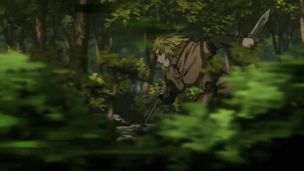

  <h1>☕ Olá, eu sou o Café!</h1>
  
Estudante de programação, aprendendo na prática e criando projetos.

  
🖼️ <a href="./assets/galeria/README.md">Ver a galeria: 174 imagens do RAR + 5 Pins</a>

  
  
  
  

Naruto · Thorfinn · Thors · Marin Kitagawa

  

## Sobre mim

- 🎓 Estudante de programação.
- 💻 Aprendendo e praticando C# e Lua em projetos pessoais e do curso.
- ☕ Sempre tem espaço para uma ideia nova e uma xícara de café.

## Tecnologias

  
  
  

## Projetos

- [OPERADOR-DE-SISTEMAS-V3](https://github.com/cafezl/OPERADOR-DE-SISTEMAS-V3) — exercícios e aplicações em C# feitos no curso.
- [cart-ride-nothing-around](https://github.com/cafezl/cart-ride-nothing-around) — projeto com scripts em Lua.

## Galeria

Animes, personagens, jogos e desenhos que curto: [abrir a galeria com 174 imagens do RAR + 5 Pins](./assets/galeria/README.md).

  Feito com café ☕ e curiosidade.

